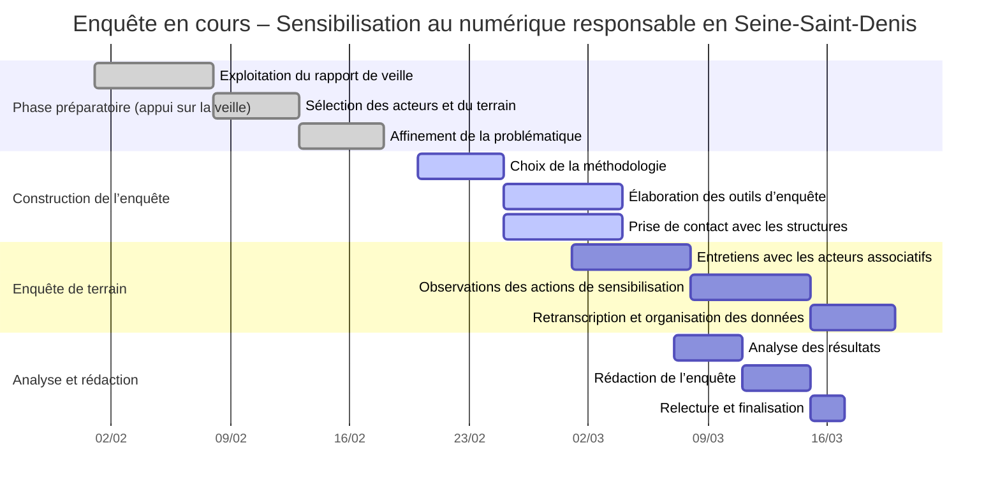

```mermaid
gantt
    title Enquête en cours – Sensibilisation au numérique responsable en Seine-Saint-Denis
    dateFormat YYYY-MM-DD
    axisFormat %d/%m

    section Phase préparatoire (appui sur la veille)
    Exploitation du rapport de veille              :done,    t1, 2025-02-01, 7d
    Sélection des acteurs et du terrain            :done,    t2, after t1, 5d
    Affinement de la problématique                 :done,    t3, after t2, 5d

    section Construction de l’enquête
    Choix de la méthodologie                       :active,  t4, 2025-02-20, 5d
    Élaboration des outils d’enquête               :active,  t5, after t4, 7d
    Prise de contact avec les structures           :active,  t6, after t4, 7d

    section Enquête de terrain
    Entretiens avec les acteurs associatifs        :         t7, 2025-03-01, 7d
    Observations des actions de sensibilisation    :         t8, after t7, 7d
    Retranscription et organisation des données    :         t9, after t8, 5d

    section Analyse et rédaction
    Analyse des résultats                          :         t10, 2025-03-07, 4d
    Rédaction de l’enquête                         :         t11, after t10, 4d
    Relecture et finalisation                      :         t12, after t11, 2d

```
