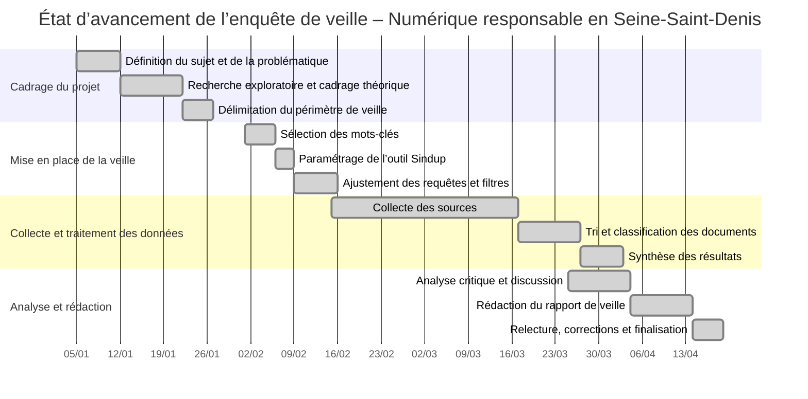

```mermaid
gantt
    title État d’avancement de l’enquête de veille – Numérique responsable en Seine-Saint-Denis
    dateFormat YYYY-MM-DD
    axisFormat %d/%m

    section Cadrage du projet
    Définition du sujet et de la problématique      :done,    t1, 2025-01-05, 7d
    Recherche exploratoire et cadrage théorique    :done,    t2, after t1, 10d
    Délimitation du périmètre de veille            :done,    t3, after t2, 5d

    section Mise en place de la veille
    Sélection des mots-clés                        :done,    t4, 2025-02-01, 5d
    Paramétrage de l’outil Sindup                  :done,    t5, after t4, 3d
    Ajustement des requêtes et filtres             :done,    t6, after t5, 7d

    section Collecte et traitement des données
    Collecte des sources                           :done,    t7, 2025-02-15, 30d
    Tri et classification des documents            :done,    t8, after t7, 10d
    Synthèse des résultats                         :done,    t9, after t8, 7d

    section Analyse et rédaction
    Analyse critique et discussion                 :done,    t10, 2025-03-25, 10d
    Rédaction du rapport de veille                 :done,    t11, after t10, 10d
    Relecture, corrections et finalisation         :done,    t12, after t11, 5d

```
