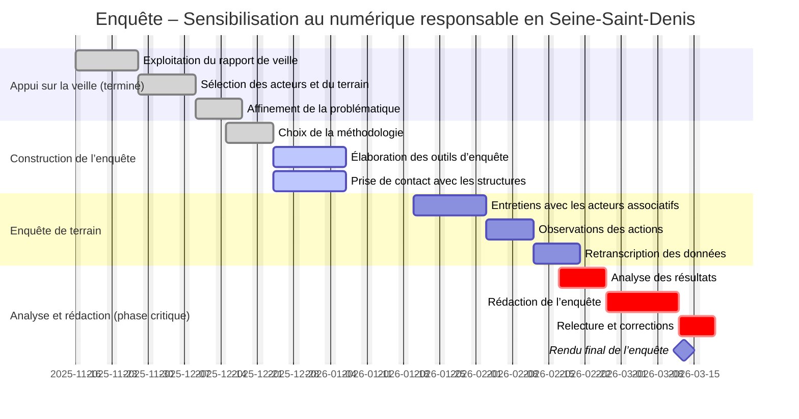

```mermaid
gantt
    title       Enquête – Sensibilisation au numérique responsable en Seine-Saint-Denis
    excludes    weekends

    section Appui sur la veille (terminé)
    Exploitation du rapport de veille          :done,    t1, 2025-11-16, 10d
    Sélection des acteurs et du terrain        :done,    t2, after t1, 7d
    Affinement de la problématique             :done,    t3, after t2, 7d

    section Construction de l’enquête
    Choix de la méthodologie                   :done,    t4, 2025-12-15, 7d
    Élaboration des outils d’enquête           :active,  t5, after t4, 10d
    Prise de contact avec les structures       :active,  t6, after t4, 10d

    section Enquête de terrain
    Entretiens avec les acteurs associatifs    :         t7, 2026-01-20, 10d
    Observations des actions                   :         t8, after t7, 7d
    Retranscription des données                :         t9, after t8, 7d

    section Analyse et rédaction (phase critique)
    Analyse des résultats                      :crit,    t10, 2026-02-17, 7d
    Rédaction de l’enquête                     :crit,    t11, after t10, 10d
    Relecture et corrections                   :crit,    t12, after t11, 5d
    Rendu final de l’enquête                   :milestone, rendu, 2026-03-13, 0d

```
